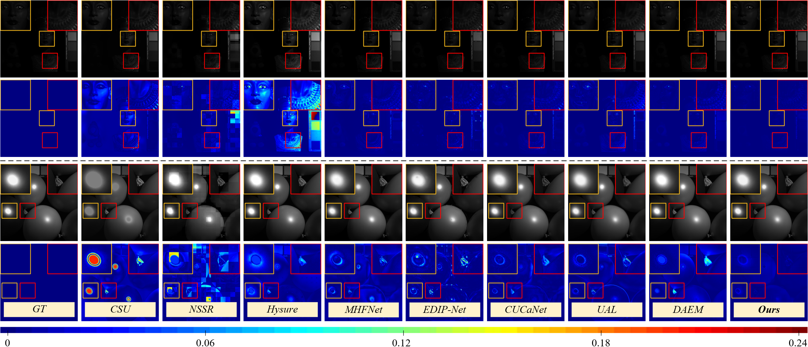

# MossFuse
This repo is the official implementation of the paper titled “**Unsupervised Hyperspectral and Multispectral Image Fusion via Self-Supervised Modality Decoupling**”, named **MossFuse**.

## Abstract

Hyperspectral and Multispectral Image Fusion (HMIF) aims to fuse low-resolution hyperspectral images (LR-HSIs) and high-resolution multispectral images (HR-MSIs) to reconstruct high spatial and high spectral resolution images. Current methods typically apply direct fusion from the two modalities without effective supervision, leading to an incomplete perception of deep modality-complementary information and a limited understanding of inter-modality correlations. To address these issues, we propose a simple yet effective solution for unsupervised HMIF, revealing that modality decoupling is key to improving fusion performance. Specifically, we propose an end-to-end self-supervised \textbf{Mo}dality-Decoupled \textbf{S}patial-\textbf{S}pectral Fusion (\textbf{MossFuse}) framework that decouples shared and complementary information across modalities and aggregates a concise representation of both LR-HSIs and HR-MSIs to reduce modality redundancy. Also, we introduce the subspace clustering loss as a clear guide to decouple modality-shared features from modality-complementary ones. Systematic experiments over multiple datasets demonstrate that our simple and effective approach consistently outperforms the existing HMIF methods while requiring considerably fewer parameters with reduced inference time.
<div align=center>

</div>

## Architecture

<div align=center>

</div>

## Results Visualization (Real Data)

<div align=center>

</div>

<div align=center>

</div>

<div align=center>

</div>
## Evaluation on CAVE：

Download the CAVE dataset([Baidu Disk](https://pan.baidu.com/s/1eH6WEm7IiXKUxs9pGr60WA?pwd=abcd), code: `abcd`).

The process of synthesizing the dataset has been included in the released code, just run this commend:
```python
python ./test.py
```
The results of several metrics (inference time, PSNR, SSIM, SAM, ERGAS), reconstruction results, and degradation parameter estimation (PSF and SRF) will be displayed under "./result".

## Environment
```python
python==3.9.0
torch==2.4.1
scikit-image==0.19.0
scikit-learn==1.5.2
numpy==1.23.0
scipy==1.13.1
tqdm==4.66.5
matplotlib==
cv2==4.10.0.84
hdf5storage==0.1.4
sewar==0.4.6
timm==1.0.9
hdf5storage==0.19.5
```

## Acknowledgements

Our code is based on the following codes, thanks for their generous open source:

- [https://github.com/WenjinGuo/DAEM](https://github.com/WenjinGuo/DAEM)
- [https://github.com/caiyuanhao1998/MST](https://github.com/caiyuanhao1998/MST)
- [https://github.com/JiaxinLiCAS/M2U-Net_TGRS](https://github.com/JiaxinLiCAS/M2U-Net_TGRS)
